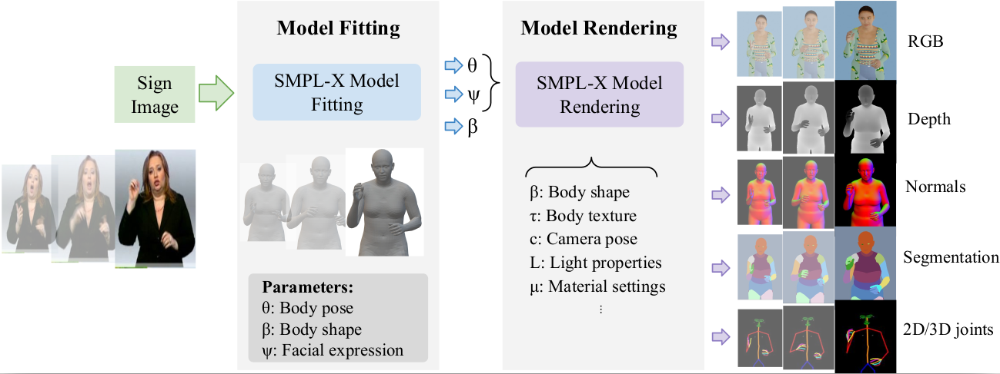

# Rendering Pipeline

This repository includes the rendering pipeline for [**SynthSL: Expressive Humans for Sign Language Image Synthesis**](https://www.dfki.de/fileadmin/user_upload/import/14793_FG2024_SynthSL.pdf) (FG 2024), to render synthetic data based on the SMPL-x model.



# SynthSL

SynthSL is publicly available for research purposes. 
To get access to the dataset, please send an email to jilliam_maria.diaz_barros [at] dfki [dot] de.

# Sign Image Synthesis Pipeline

The implementation of our SwinGenerator and sign image synthesis architecture can be forked from [here](https://github.com/jilliam/SynthSLGen). 


# Setup and demo

In progress...

## Citation

If you find this repository useful for your research, please cite the following paper:

```
@inproceedings{diazbarros2024SynthSL,
  title={SynthSL: Expressive Humans for Sign Language Image Synthesis},
  author={D{\'\i}az Barros, Jilliam Mar{\'\i}a and Wang, Chen-Yu and Malik, Jameel and Arafa, Abdalla and Stricker, Didier},
  booktitle={Int. Conf. on Automatic Face and Gesture Recognition (FG)},
  year={2024},
  organization={IEEE}
}
```

## Acknowledgments

This repository is partially based on the code from [SURREAL](https://github.com/gulvarol/surreal) and [ObMan](https://github.com/hassony2/obman_render).
